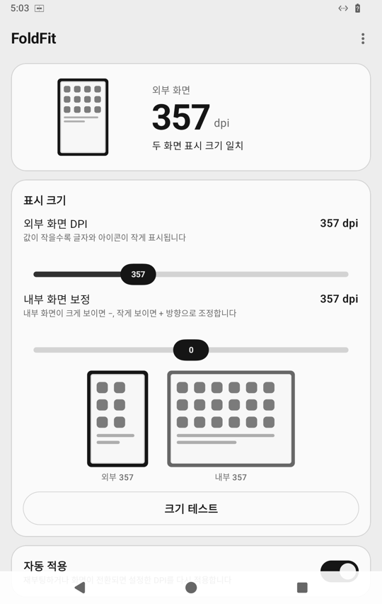
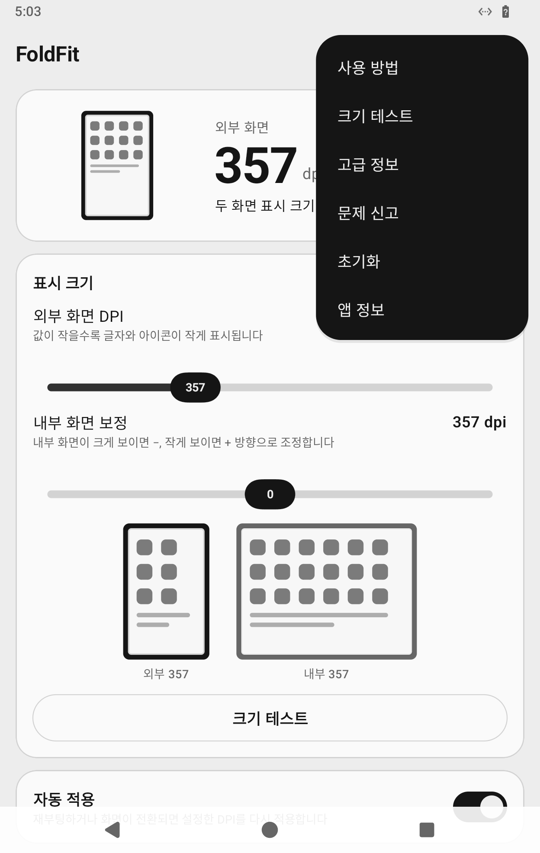
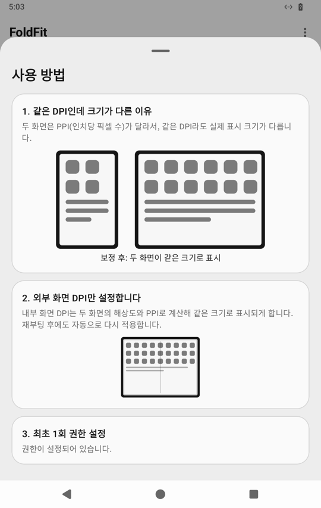
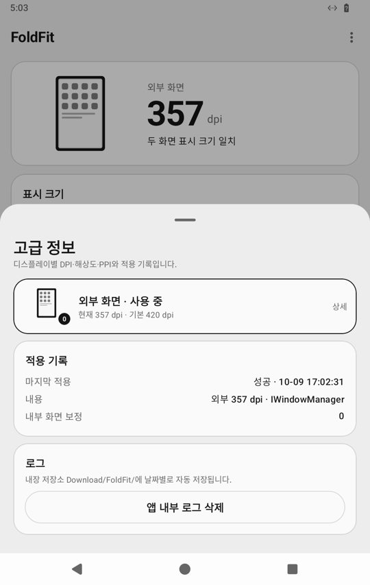

# FoldFit

**Galaxy Z Fold의 외부·내부 화면에서 글자와 아이콘이 같은 크기로 보이게 맞춰 주는 앱**

폴드는 외부 화면과 내부 화면의 픽셀 밀도(PPI)가 달라서, 같은 DPI(화면 크기 설정)를 써도 두 화면에서 글자와 아이콘의 실제 크기가 다르게 보입니다. 화면을 더 넓게 쓰려고 `adb shell wm density`로 DPI를 낮춰도, 재부팅하면 기본값으로 돌아가고 두 화면을 따로 맞추기도 번거롭습니다.

FoldFit은 외부 화면 DPI 하나만 정하면 내부 화면 DPI를 두 화면의 해상도와 PPI로 계산해, 접어도 펴도 같은 실제 크기로 보이게 맞춥니다. 재부팅하거나 화면을 전환해도 자동으로 다시 적용합니다. ROOT나 Shizuku 없이, PC의 adb로 권한을 처음 한 번만 주면 됩니다.

<p align="center">
  
  
  
  
</p>

## adb 명령만 쓸 때와 비교

| | `adb shell wm density`만 쓸 때 | FoldFit |
|---|---|---|
| 바꿀 때마다 | PC를 연결하고 명령을 다시 입력 | 폰에서 슬라이더로 바로 조절 |
| 재부팅 후 | 기기 기본값으로 돌아가 다시 입력해야 함 | 부팅 뒤 자동으로 다시 적용 |
| 외부·내부 화면 | 같은 값을 넣으면 두 화면의 실제 크기가 다름. 값을 따로 계산해야 함 | 두 화면의 PPI 비율로 내부 DPI를 자동 계산 |
| 디스플레이 번호 | 접고 펼 때 `-d 0`/`-d 1`이 가리키는 화면이 바뀌어 헷갈림 | 해상도로 외부·내부를 알아보고 각각 적용 |
| 다른 설정에서 바뀌면 | 알 수 없음 | 감지해서 '이 값을 기준으로' 또는 '복원' 중 고르게 함 |
| 맞았는지 확인 | 눈대중 | 크기 테스트(두 화면의 줄 수, 카드로 맞춘 자) |
| 되돌리기 | `wm density reset` 명령을 기억해야 함 | 메뉴 → 초기화 → 기본 DPI로 복원 |
| PC가 필요한 때 | 매번 | 처음 권한을 줄 때 한 번 |

## 주요 기능

- **외부 화면 기준 자동 계산**: 외부 화면 DPI만 정하면 내부 화면 DPI는 `외부 DPI × 내부 PPI ÷ 외부 PPI`로 계산합니다. 필요하면 내부 화면을 ±20 범위로 보정할 수 있습니다.
- **두 화면에 각각 적용**: 폴드는 화면(디스플레이 ID)마다 DPI를 따로 저장하므로, 확인된 두 화면에 각각 적용합니다.
- **자동 적용**: 부팅 뒤(0·5·15·30·60초 확인), 접기/펼치기 뒤, 다른 앱이 DPI를 바꿨을 때 다시 확인합니다. 감지는 이벤트 방식이라 상주하거나 주기적으로 깨어나지 않습니다.
- **외부 DPI 변경 감지**: 시스템 설정의 화면 크기 등으로 DPI가 바뀌면 덮어쓰지 않고, 그 값을 기준으로 할지 이전 값으로 복원할지 알림과 홈 카드로 묻습니다.
- **크기 테스트**: 두 화면은 실제 높이가 거의 같아서, 크기가 맞으면 한 화면에 들어가는 줄 수도 같습니다. 전체 화면에 번호 매긴 줄을 채워 접고 펴며 비교할 수 있고, 카드(짧은 변 54 mm)로 맞춘 자로 실제 길이도 잴 수 있습니다.
- **권한 설정 안내**: 연결 방식(USB/무선)과 PC 운영체제(Windows/Mac/Linux)에 맞춘 단계별 안내, 명령 복사, 자주 나오는 오류 해결 방법을 앱 안에서 보여 줍니다. 안내문을 PC로 보내거나 메일로 보낼 수도 있습니다.
- **문제 신고**: 진단 파일과 오늘 로그를 첨부한 메일을 바로 작성합니다. 로그는 `다운로드/FoldFit/`에 날짜별로 저장됩니다.

## 호환 기기

Android 12(API 31) 이상의 Galaxy Z Fold 시리즈를 대상으로 합니다.

| 기기 | 상태 | 비고 |
|---|---|---|
| Galaxy Z Fold8 (SM-F971N) | 실기기 확인 | 화면별 적용, 자동 적용, 크기 일치 확인 |
| Galaxy Z Fold7 | 지원(실기기 미확인) | 제조사 패널 사양으로 PPI 보정 |
| Galaxy Z Fold6 | 지원(실기기 미확인) | 제조사 패널 사양으로 PPI 보정 |
| Galaxy Z Fold4 · Fold5 | 지원(실기기 미확인) | 제조사 패널 사양으로 PPI 보정 |
| Galaxy Z Fold3 | 지원(실기기 미확인) | 제조사 패널 사양으로 PPI 보정 |
| Galaxy Z Fold2 (Android 12 이상) | 동작 예상 | 사양표에 없어 기기가 알려 준 PPI로 계산 |
| 그 밖의 폴더블(Pixel Fold 등) | 동작 예상 | 기기가 알려 준 PPI로 계산. 화면별 저장 방식이 다르면 접기/펼치기 때 다시 적용 |
| Galaxy Z Flip 시리즈 | 대상 아님 | 외부 화면이 보조 화면이라 맞출 필요가 거의 없음 |
| Android 11 이하 | 지원 안 함 | minSdk 31 |

기기가 알려 주는 PPI가 실제 패널과 다를 수 있어, 사양표에 있는 기종은 제조사 사양(해상도·대각선)으로 PPI를 다시 계산합니다. 확인된 기기가 늘면 이 표에 추가합니다. 다른 기기에서 써 보셨다면 앱의 메뉴 → 문제 신고로 진단 파일을 보내 주세요.

## 설치

1. [Releases](../../releases/latest)에서 최신 APK를 내려받아 설치합니다(출처를 알 수 없는 앱 설치 허용 필요).
2. 앱을 열면 **권한 설정 필요** 카드가 보입니다. [설정 방법]을 누르면 PC 운영체제와 연결 방식에 맞춘 안내가 나옵니다.
3. 안내대로 PC에서 아래 명령을 한 번 실행합니다.

```bash
adb shell pm grant com.local.folddpifix android.permission.WRITE_SECURE_SETTINGS
```

이 권한은 일반 권한 창으로는 받을 수 없어 adb가 필요합니다. 재부팅해도 유지되며, 권한을 준 뒤에는 USB/무선 디버깅을 꺼도 됩니다. 앱을 삭제하면 권한도 사라지므로, 업데이트는 삭제하지 말고 덮어 설치(`adb install -r` 또는 APK 실행)하세요.

### 안 될 때

| PC에 나온 문구 | 해결 |
|---|---|
| `protocol fault (couldn't read status message)` | 폰의 VPN을 끄고, 같은 와이파이인지 확인한 뒤 `adb kill-server` → `adb start-server`. 그래도 안 되면 폰과 PC를 재시작 |
| `more than one device/emulator` | `adb devices`로 목록을 보고 `adb -s <이름> shell pm grant …`처럼 기기를 지정 |
| `unauthorized` | 폰의 'USB 디버깅 허용' 창에서 허용. 안 보이면 개발자 옵션 → USB 디버깅 권한 승인 취소 후 다시 연결 |
| `'adb' is not recognized` | Windows는 platform-tools 폴더에서 `.\adb`로 실행 |

무선 페어링에는 adb 30 이상이 필요하고, `adb pair`(페어링 팝업의 포트)와 `adb connect`(무선 디버깅 첫 화면의 포트)는 포트가 다릅니다.

## 사용

1. **표시 크기**에서 외부 화면 DPI를 정합니다. 값이 작을수록 글자와 아이콘이 작게(화면이 넓게) 표시됩니다. 내부 화면 DPI는 자동으로 계산되고, 미리보기에서 두 화면의 크기를 비교할 수 있습니다.
2. 한 번 접었다 펴서 두 화면의 정보를 모으면 두 화면에 모두 적용됩니다.
3. **자동 적용** 스위치를 켜 두면 재부팅·화면 전환·외부 변경 때 알아서 다시 맞춥니다.
4. 크기가 미세하게 다르게 느껴지면 **크기 테스트**로 확인하고 **내부 화면 보정**으로 다듬습니다.

### 외부 DPI 변경 처리

앱은 화면마다 마지막으로 적용한 DPI를 기억합니다. 시스템 설정의 화면 크기, 다른 앱, adb 등에서 값이 바뀌면 자동으로 덮어쓰지 않고, 홈 맨 위 카드와 알림에서 **이 값 기준으로 설정** 또는 **이전 값으로 복원**을 고르게 합니다. 감지는 WorkManager의 콘텐츠 URI 트리거(`Settings.Secure.display_density_forced`)라 상주 프로세스나 주기 확인이 없습니다. 부팅 직후 기기가 기본값으로 되돌린 경우는 외부 변경이 아니라 복원 대상입니다.

### 안전장치

- 범위(240~640)를 벗어난 값은 저장하지 않습니다.
- 현재 값이 목표와 같으면 다시 적용하지 않습니다.
- 자동 적용은 1분에 최대 5회입니다(시스템과 서로 덮어쓰는 무한 반복 방지). 사용자가 직접 바꾸는 것은 제한하지 않습니다.
- 보정 비율이 0.7~1.4를 벗어나거나 결과가 범위를 넘으면 적용을 보류합니다.
- 부팅 재확인은 unique work(`dpi_recover`, REPLACE)라 작업이 겹치지 않습니다.

### 개인정보와 권한

네트워크·저장소·위치 권한을 쓰지 않으며, 어떤 데이터도 외부로 보내지 않습니다. 로그와 진단 파일은 기기 안(`다운로드/FoldFit/`)에만 저장되고, 사용자가 문제 신고로 직접 보낼 때만 메일에 첨부됩니다. 쓰는 권한 전체와 이유는 앱 정보 화면에 있습니다.

## DPI 복구

화면이 너무 작거나 커서 앱을 조작하기 어려우면 PC에서 다음 명령을 실행하십시오.

```bash
adb shell wm density reset
```

ADB 없이 복구하려면 앱의 메뉴 → 초기화 → [기본 DPI로 복원]을 누르거나, 설정 → 디스플레이 → 화면 크게/작게를 쓰십시오.

## 삭제

```bash
adb uninstall com.local.folddpifix
```

단말의 설정 → 애플리케이션에서 삭제해도 됩니다. 삭제한 뒤에도 마지막으로 적용한 강제 DPI는 남아 있습니다. 기본값으로 돌리려면 삭제 전에 [기본 DPI로 복원]을 누르거나 `adb shell wm density reset`을 실행하십시오.

## DPI 적용 방식

`wm density N`은 내부적으로 `IWindowManager.setForcedDisplayDensityForUser(0, N, user)`를 호출합니다. AOSP의 `WindowManagerService`는 이 호출에 `WRITE_SECURE_SETTINGS` 권한만 요구합니다(`@EnforcePermission(WRITE_SECURE_SETTINGS)`). 반면 `Settings.Secure.display_density_forced` 값은 WMS가 감시하지 않습니다. 그래서 이 값만 쓰면 화면에 바로 반영되지 않고, 사용자 전환이나 부팅 때에야 읽힙니다. 이 앱은 그 방식을 쓰지 않습니다.

`DpiManager`는 아래 순서로 시도하고, 매번 적용한 뒤 값을 다시 읽어 실제로 바뀌었는지 확인합니다.

1. **IWindowManager binder 호출(1순위).** `WindowManagerGlobal.getWindowManagerService()`로 얻은 객체에서 `setForcedDisplayDensityForUser`·`clearForcedDisplayDensityForUser`·`getInitialDisplayDensity`·`getBaseDisplayDensity`를 호출합니다. `wm density`와 같은 경로를 앱 UID로 직접 부르는 방식입니다. Android 9 이상의 hidden API 제한은 `HiddenApiBypass`로 `IWindowManager`/`WindowManagerGlobal`에 대해서만 해제합니다.
2. **`cmd window density N` → `wm density N` 프로세스 실행(대체 경로).** exit code·stdout·stderr를 로그에 남기고, 실행 뒤 값을 다시 읽어 성공 여부를 판정합니다.

현재 값은 `Physical density`(기기 기본값)와 `Override density`(강제값)로 보여 주며, `wm density` 출력과 같은 의미입니다.

## 디스플레이 번호별 적용

Samsung Galaxy Fold는 외부·내부 화면이 디스플레이 번호로 따로 있습니다(`wm density <dpi> -d 0`은 외부, `-d 1`은 내부로 알려져 있습니다). 앱은 `IWindowManager`에서 0~3번 디스플레이를 읽고, 해상도로 어느 화면인지 확인되는 디스플레이에 `setForcedDisplayDensityForUser(id, …)`로 보정 DPI를 바로 적용합니다. 그래서 접지 않아도 부팅 때 두 화면을 한꺼번에 맞출 수 있습니다. 어느 화면인지 확인할 수 없는 디스플레이는 건드리지 않습니다. 꺼진 화면은 현재 값을 읽을 수 없을 수 있어서, 이때는 "적용(확인 불가)"으로 기록하고 같은 값을 반복 적용하지 않습니다. 메뉴 → 고급 정보에서 번호별 해상도·PPI·기본·현재·설정 DPI를 확인할 수 있습니다.

## 접기/펼치기

Galaxy Fold는 접고 펼칠 때 기본 display(0) 뒤의 물리 화면이 바뀝니다. AOSP `DisplayWindowSettings`는 강제 density를 물리 화면(`DisplayInfo.uniqueId`)별로 저장합니다. 그래서 펼친 상태에서 맞춘 값이 접은 화면에는 적용되지 않을 수 있습니다. 부팅 직후에는 그때 켜져 있던 화면만 고칠 수 있습니다.

자동 적용을 켜면 `FoldWatchService`(foreground service)가 `DisplayManager.DisplayListener` 이벤트를 받아 확인하고, 두 화면이 모두 맞춰지면 스스로 멈춥니다. 폴링은 하지 않습니다. SM-F971N에서 DPI가 패널별로 따로 저장되는 것을 확인했습니다.

## 프로젝트 구조

[Android 앱 아키텍처 가이드](https://developer.android.com/topic/architecture)의 계층 구분(UI · domain · data)을 따릅니다. 의존 방향은 `ui`·`background` → `domain` → `data`입니다. 계산은 모두 domain의 순수 함수에 두고 UI는 그리기만 합니다.

```
app/src/main/java/com/local/folddpifix/
├── App.kt · AppInfo.kt          Application(크래시 기록·숨은 API 허용), 제품 이름
├── data/                        데이터 계층
│   ├── display/                 DpiController, DpiManager(IWindowManager, 디스플레이 ID별), PermissionReset(pm revoke 명령)
│   ├── settings/                SettingsRepository(외부 DPI·보정·자동·학습 화면·꺼짐 PPI·적용 기록·외부 변경)
│   └── log/                     LogRepository, PublicLogFile(Download/FoldFit), CrashRecorder, DiagnosticReport
├── domain/                      판단·계산(단위 테스트 대상)
│   ├── DpiPolicy · ScreenPolicy  검증·반복 방지(자동만) / 외부·내부 판정(픽셀 수)·PPI 비율·적용 보류
│   ├── PanelSpec(DensityPlan)    PPI 결정(사양표 → 꺼짐 보고값 → 보고값), 목표 계산 일원화
│   ├── ScreenGeometry            화면 방향(내부 가로/세로 판정), 줄 수, dp → mm
│   ├── ExternalChange            외부 DPI 변경 판정, '이 값 기준' 역계산
│   ├── ScreenLearner             화면 학습(접는 중 중간값 차단)
│   └── DpiFixer                  확인 → 적용 → 검증 공통 경로, 외부 변경 보류·해소
├── background/                  BootReceiver · DpiWorker(부팅 재확인) · FoldWatchService(전환 감지)
│                                · DensityWatchWorker(DPI 변경 감지) · ExternalChangeNotifier/Receiver(선택 알림)
└── ui/
    ├── liquid/                  공통 UI 컴포넌트
    ├── text/Copy.kt             화면 문구 한곳(DPI·PPI·권한 등 표준 용어, 내부 구현 이름 금지 — 테스트로 강제)
    ├── art/                     그림: DeviceFrame(공통 기기 틀) 위에 폴드 기기·두 화면 미리보기·원리·연결·안내 장면
    ├── home/                    HomeScreen(상태·할 일·표시 크기·자동 적용·초기화), HomeViewModel, UiState
    ├── sizetest/                크기 테스트(세로 줄 수 비교, 줄 세기 화면, 기준 도형, mm 자)
    ├── help/                    사용 방법, 권한 설정 안내(GrantGuideSheet/Content)
    ├── advanced/                고급 정보(디스플레이 ID·해상도·PPI·설정 DPI·적용 기록·로그)
    ├── about/                   앱 정보, 필요 권한(AppPermissions)
    └── components/              InfoRow, CommandBox
```

## 빌드

JDK 17과 Android SDK(compileSdk 35)가 있으면 Gradle로 빌드합니다.

```bash
./gradlew assembleRelease testDebugUnitTest
```

`build-apk.sh`는 Android Studio 없이 CLI로 빌드하는 스크립트입니다. 필요한 JDK·SDK를 사용자 폴더(`$HOME/tools/android`, `FOLDDPI_TOOLS`로 변경 가능)에 받아 쓰며, ARM64 Linux에서는 ARM64용 aapt2를 자동으로 씁니다. x86_64 호스트에서는 `./build-apk.sh --docker`로 컨테이너 빌드도 할 수 있습니다.

```bash
./build-apk.sh             # debug APK + 단위 테스트
./build-apk.sh --release   # release APK
./install-and-grant.sh app/build/outputs/apk/release/app-release.apk   # 설치 + 권한 부여(adb 연결 필요)
```

### 테스트

- 단위 테스트(56개): DPI 계산·PPI 결정·화면 학습·외부 변경 판정·반복 방지·화면 방향·문구 규칙 등. `./gradlew testDebugUnitTest`
- 화면 캡처: `./screenshots.sh`가 Robolectric과 Roborazzi로 주요 화면을 PNG로 만듭니다(`app/build/outputs/roborazzi`).
- 에뮬레이터 확인: 64비트 Android 컨테이너(redroid 등)에 설치해 `adb shell wm size`/`wm density`로 접기·펼치기와 외부 변경을 흉내 낼 수 있습니다.

## 알려진 제약

- **실기기 확인 범위.** Galaxy Z Fold8(Android 17)에서 화면별 적용과 자동 적용을 확인했습니다. 외부 DPI 변경 감지·권한 초기화·크기 테스트는 Android 14 에뮬레이터에서 확인했습니다.
- **꺼진 화면의 외부 변경.** 꺼진 패널(-d 1)의 DPI는 `Settings.Secure`에 기록되지 않을 수 있어, 그 화면의 외부 변경은 접거나 펼 때 감지됩니다(추정).
- **권한 회수는 PC에서.** WRITE_SECURE_SETTINGS는 권한 그룹이 없어 앱이 스스로 회수할 수 없습니다(`revokeSelfPermissionsOnKill` 거부 확인). 앱을 다시 설치해도 사라지므로 업데이트는 `-r`로 설치하십시오.
- **Hidden API 정책.** 앞으로 `HiddenApiBypass`가 막히면 `cmd window density` 경로로 넘어가며, 둘 다 막히면 실패 로그를 남깁니다.
- **Direct Boot.** 잠금 해제 전에는 WorkManager를 쓸 수 없어 1회만 확인합니다.
- **서명.** release APK도 debug 키로 서명하므로 Play Protect 경고가 나올 수 있습니다.

## 라이선스

Copyright (C) 2026 lala5bok

이 프로그램은 [GNU General Public License v3.0](LICENSE)(GPL-3.0)으로 배포하는 자유 소프트웨어입니다. 누구나 무료로 쓰고, 고치고, 다시 배포할 수 있습니다. 다만 고친 버전이나 이 코드를 포함한 프로그램을 배포할 때는 그 소스도 GPL-3.0으로 공개해야 합니다.

GPL-3.0 조건(소스 공개)을 따르기 어려운 회사나 제품에는 별도 상용 라이선스를 제공합니다. 문의: lala5bok@gmail.com

이 앱이 쓰는 라이브러리(AndroidX·Jetpack Compose, HiddenApiBypass)는 Apache License 2.0이며 GPL-3.0과 함께 쓸 수 있습니다.
